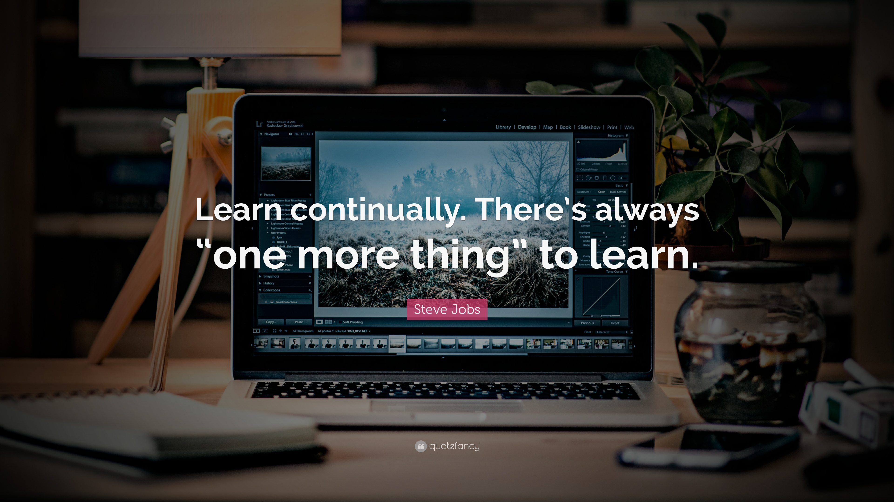

<!--
Hello, my name is krit, .
-->

# Hi there! Welcome to my GitHub Profile! 👋

##  My name is krit, I'm a data scientist 

    

📖 Hello, I’m krit ,but you can call me “ T.boy ” that’s my nick name.
I was Born in 1996 and raised in Bangkok , Thailand. I’m a half 
Thai half Nigeria on a journey to know what it means to be truly creative 
entrepreneur. I especially enjoy the Technology of how app is creates . I 
also like to dabble in all types of mediums and genres such as TechStartup , AI , Machine learning. I intend to experiment with other avenues 
such as Coding and how Technology can solve the problem in the near 
future.
I’m actively seeking opportunities to hone both my technical skills and 
soft skills for Tech and management. I love the endless possibilities the 
creative process brings. And I hope that this portfolio brings you as much 
joy as it bring me

📖 Now, I _enjoy_ learning new technologies and new programming languages by making something from scratch step by step as well as working on real-world projects as part of my day-to-day job 🛠

📖 __Self-learning__ is one of the most important and enjoyable parts of my life ☺️ I soon found out that GitHub is such a good place for me to record my never-ending learning journey from a technophobe to a technophile 🔥 To me, it is my open learning journal where I can not only keep my notes and references while learning new technical stuff but also share them with others who may find them helpful 📔

    

  
🍀🍀🍀

## 🛠 Languages and Tools
📖 I have been learning and exploring these following tools and languages

 

                             

## 📊 Stats

## 🏆 Certificates 

    
    

 

    
    

    
    
    

 
 
